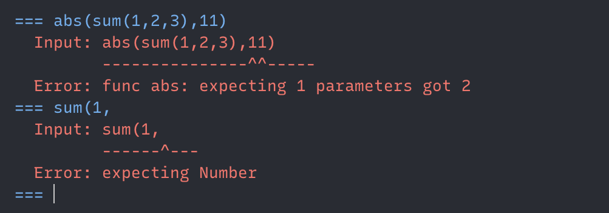

# A Simple Calculator

Based on decimal.Decimal.

> Decimal “is based on a floating-point model which was designed with people in mind, and necessarily has a paramount guiding principle – computers must provide an arithmetic that works in the same way as the arithmetic that people learn at school.” – excerpt from the decimal arithmetic specification

### How to use

install

```
pip install dailycalc
```

import into your code

```python
from dailycalc import calculate

print(calculate("sum(123+3)"))
```

once-off calculate

```bash
python -m dailycalc "sum(0.1, 0.2)"
```

iteractive mode

```bash
python -m dailycalc -i
```

or

```bash
idailycalc
```

### Operators & Functions

currently supporting:

"+ - \* / ^"

"sum max min abs round hex oct"

### Interactive mode

Every result is stored in register from \[a-z\] cyclically, that is when reaching the last one "z", the register would go back to "a" and cover the old value.

"@a" gives the value in "a". "@@" gives the previous result.'

for example:


### Support HEX, OCT, Scientific input

1. HEX: "0x12E", "0X12E" only support integar
2. OCT: "0o123", "0O123" only support integar
3. Scientific: "-123.12E-123" or "-123.12e+123"

### Support terminal highlight in -i

### Error message with highlight



### reference for interactive mode

```
--- Modes ---
STAY mode (prompt:"===") (Default)
save result by call "save" command
WALKING mode (prompt:">>>")
automatically save results and move to next register
--- Commands ---
"exit" exit program.
"show" show all results in register.
"reset" clear all results in register.
"stay" switch to STAY mode.
"go" save result & switch to WALKING mode.
"save [tag]" save result (in STAY Mode).
--- Functions ---
sum(1, 2, 2+1) => 6
max(1, sum(2, 1)) => 3
min(1, 2) => 1
abs(1-12) => 11
round(12.16, 1) => 12.2
hex(10) => 0xa
oct(10) => 0o12
```

### Require colorama [https://pypi.org/project/colorama/]

## Future Plans

add more function & operator, bugfix.
